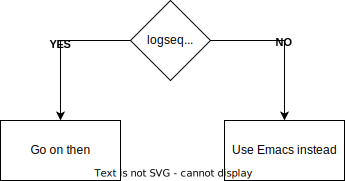

# This page was made in Logseq
In *logseq*, **everything is a list.**\
This works fine when in logseq but looks horrible on any "standard" `markdown` viewer, \
such as

- github
- gitlab
- VSCode
- etc...

So we need to get rid of all this list nonsense when exporing to "standard/github" markdown.
<br>

This simple utility can help you export your logseq pages as beautiful markdown notes, including:
- **images**\


- **Attachments**:\
[blackmagic-io-12.8.1a1-001-fix_for_kernel_6.8.patch](assets/blackmagic-io-12_1719829840680_0.8.1a1-001-fix_for_kernel_6.8.patch)

- **drawio embeddings**:\


- And activity tracking (sort of) like:
	- **&#x2610; TODO** implement YT embeddings
	- **&#x231B; DOING** code cleanup\
	- **&#x23F2; LATER** fix bugs
	- **&#x2611;** ~~publish the first working prototype~~

## Supported syntax
It currently support all syntax that I make use of:
> **QUOTE**\
multi-line quote block

Code:
```
multi-line code block
```
And maybe something else?\
You let me know. Generally speaking I try not to mess up the original content more than necessary.

## How to use
```
./logseq-md-export.py /path/to/logseq/pages/yourpage.md /your/destination/folder
```
## Quality warning
This implementation is a bit rushed, and needs some cleaning up, but everything should work fine in most cases.\
If not, please **open an Issue** describing the problem (screenshots are also useful) and attach the relevant logseq page.
